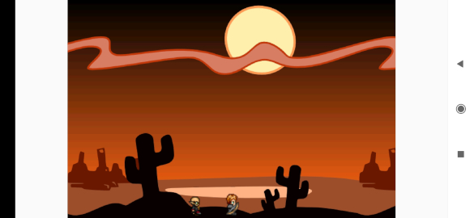
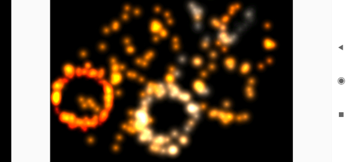

# AndEngine


Free Android 2D OpenGL Game Engine for Android.
This is a fork of https://github.com/nicolasgramlich/AndEngine


State Changes
=============

This is a single Android project including the engine, engine extensions and demo.
Compiled using Android Studio 4.0.1 and Gradle 6.1.1
For documentation about the engine please visit original source.


Features
========

* A lot of nice features.. Just check it out !


Screenshots
===========





Try it
======

You can install the application in either of these ways:

  * APK: [app-debug.apk](app/build/outputs/apk/debug/app-debug.apk)
  * Source code: clone the repository, compile with gradle and install with adb
  * Import project with Android Studio 4.0.1 and click on play >

```
    export ANDROID_HOME=/home/$USER/Android/Sdk
    ./gradlew assembleDebug
    adb install -r app/build/outputs/apk/debug/app-debug.apk

```
